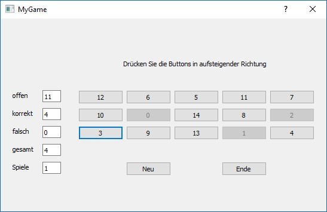

# Python GUI Programmierung, ein einfaches Spiel

## Die Aufgabenstellung
Erstelle ein einfaches Spiel auf Basis der Abbildung unter Anwendung des MVC Design Patterns!

### Grundanforderungen
* GUI zunächst mittels QT-Designer erstellt
* Eine eigene Klasse kümmert sich um die Statistik
* Eine eigene Klasse regelt den Ablauf des Spiels und reagiert auf die QPushButtons
* Signals und Slots zum Schließen des Formulars über einen eigenen Button
* Funktionalität der weiteren Buttons gemäß der Beschreibung
* GUI skaliert bei einem Resize entsprechend
* Beim Starten sowie bei einem Klick auf "Neu" werden die Zahlen zufällig gemischt und auf die Buttons verteilt.
* Sphinx-Dokumentation

### Erweiterungen
* Wende das Gelernte über Threads an und schreibe einen eigenen Thread bzw. nutze die Möglichkeiten von QT.
* Dieser Thread steigert die Schwierigkeit des Spiels, indem er in regelmäßigen Abständen (z.B. alle 2 Sekunden) die Zahlen neu auf die Buttons verteilt - allerdings nur, wenn gerade ein Spiel läuft! Der Cursor soll auf dem gecklickten Button stehen bleiben. Beim richtigen Klicken wird der vorige, richtige Button disabled.

### Umgebung und Tests

Es wird PyBuilder als Build-Umgebung verwendet. Nähere Informationen sind unter [3] zu finden. Um eine Liste an Tasks
zu erhalten können folgende Befehle ausgeführt werden:

    python setup.py # installs necessary packages
    pyb -t 

Um die Umgebung auch für PyCharm einzurichten, kann der folgende Task ausgeführt werden:

    pyb pycharm_generate

Die Abhängigkeiten können optional auch in einer virtuellen Umgebung geladen werden. Dabei werden alle notwendigen
Pakete in ein eigenes Verzeichnis geladen und die PATH Variable auf dieses Verzeichnis hin angepasst. Die 
Benutzeranleitung für Virtualenv ist hier [5] zu finden.

Das Beispiel soll entsprechend der mitgelieferten Tests implementiert werden. Folgende Befehle werden bei der Abnahme
ausgeführt und bewertet:

    pyb publish run_unit_tests
    pyb sphinx_generate_documentation

### Weitere Überlegungen
Vergleiche die Klasse threading.Thread mit der Klasse QThread - welche Unterschiede gibt es? Wann lohnt es sich, einen QThread zu verwenden? 

Mach dir außerdem Gedanken über Threadsynchronisation - muss etwas synchronisiert werden? Wenn ja, was?

### Spielbeschreibung im Detail
Startet ein Spiel ist der Cursor auf der Zahl 0. 
Der Cursor bleibt auf der Zahl 0, auch wenn nach 2 sec in der erweiterten Ausführung wieder die Zahlen neu gemischt werden. Er springt also mit der Zahl auf den neuen Button.
Die Zahl 0 muss als erste geklickt werden. Der Cursor bleibt nach diesem Click auf der Zahl 0 bis die nächste Zahl geklickt wird. Beim klicken der nächsten Zahl wird der Cursor auf diese gesetzt und bleibt wiederum auf dieser, auch wenn die Zahlen neu verteilt werden. 

Wurde nun die richtige Zahl (in diesem Falle '1') geklickt, so wird der Button mit der Zahl '0' disabled, er ergraut also und kann nicht mehr geklickt werden. Werden die Zahlen nach 2 sec wieder neu auf die Buttons verteilt, wird wiederum der neue Button mit der Zahl '0' ergraut und disabled. 
Disabled wird also immer erst, wenn die nächsthöhere, richtige, Zahl geklickt wird. 

Wurde ein falsche Zahl, also nicht '1', gelickt, so wird der Button mit der Zahl '0' nicht ergraut und nicht disabled und es gibt für den Click einen Fehlerpunkt. Werden weitere falsche Zahlen geklickt, werden jeweils wieder Fehlerpunkte vergeben, aber erst wenn die Zahl '1' gelickt wird, gibt es einen Richtigpunkt und 0 wird ergraut und disabled.
Wiederum erst beim Klicken der nächsthöheren Zahl nach der Zahl '1', wird der Button mit der Zahl '1' ergraut bzw disabled.
Lediglich beim Klicken der höchsten Zahl '14' wird dieser Button sofort disabled, soferne bereits alle niedrigeren Zahlen in richtiger Reihenfolge gedrückt waren.

## Umsetzung
<!---
Was musste recherchiert werden um die Aufgabe lösen zu können?
Welche Erfahrungen wurden gemacht?
Wie ist man zum Ergebnis gekommen?
-->

Wir bewegen nicht die Buttons sondern wir ändern die Zahlen auf den Buttons.
Die Buttons sind eine List von buttons in der view mit dem namen self.buttons[i] wobei i von 0 bis 14 reicht.

### Tool Chain:
Installation von PyQT
    
    pip3 install PyQT5
    
(früher wurde PySide verwendet, wobei PySide so nur mit älteren Python Versionen kompatibel ist, also nicht mit 3.6.2 bzw. 3.6.3)

Mit QT Designer kreieren wir unsere Gui gameview.ui, diese wird in eine Python Gui verwandelt mittels
    
    pyuic5 gameview.ui -o gameview.py
    
Um Buttons als Liste in der View zu haben, wird einiges an Überlegung notwendig sein.

## Quellen
[1] Qt manual, Qt Designer manual <http://doc.qt.io/qt-5/>

